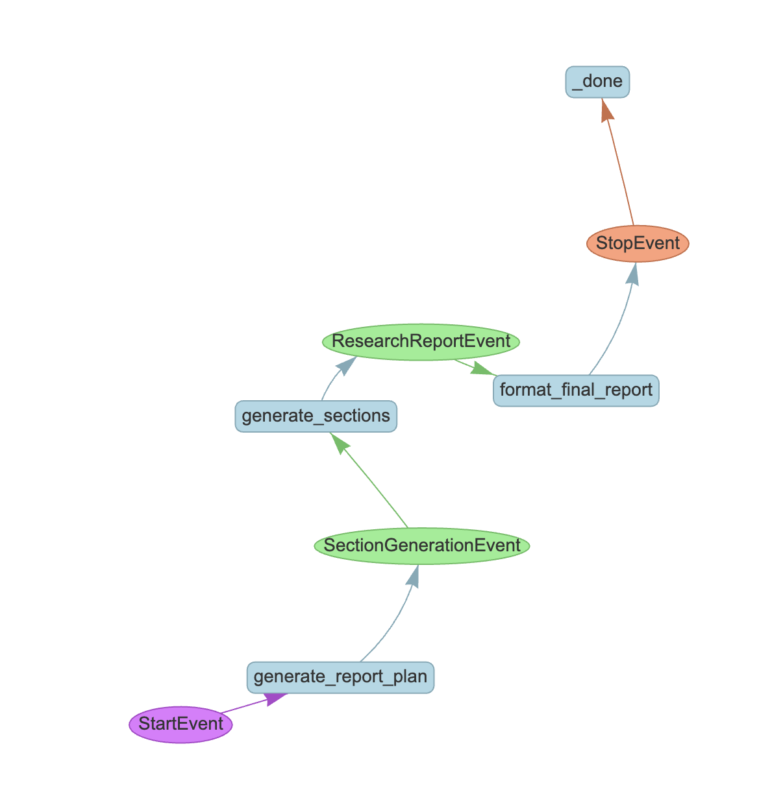

# Open Deep Research LlamaIndex

This project is inspired by [Open Deep Research](https://github.com/langchain-ai/open_deep_research), which uses LangGraph for implementation. Our version leverages [LlamaIndex](https://docs.llamaindex.ai/en/stable/understanding/workflows/) to create a powerful, modular workflow for research and analysis.

Open Deep Research LlamaIndex provides a structured approach to generating comprehensive research reports on any topic using large language models, with a focus on modularity, extensibility, and real-time results.


## Features

- **Modular Workflow Architecture**: Easily extensible with nested workflows
- **Automated Research**: Generate queries and perform web searches
- **Structured Reports**: Create well-organized reports with customizable sections
- **Performance Monitoring**: Track execution time of workflow steps
- **Streaming Results**: Get real-time updates as the report is generated

## Installation

```bash
git clone https://github.com/Davy-hou/open_deep_research_llamaIndex.git
cd open_deep_research_llamaindex
pip install -r requirements.txt
```

## Quick Start

go to examples folder and run `basic_research.py`

## Configuration

Create a `.env` file in your project root (see `.env.example` for a template):

```
# API Keys
OPEN_ROUTER_API_KEY=your_openrouter_api_key_here
TAVILY_API_KEY=your_tavily_api_key_here
```

## Project Structure

```
├── src/
│   └── research/
│       ├── config/       # Configuration management
│       ├── models/       # Data models using Pydantic
│       ├── utils/        # Utility functions and prompts
│       └── workflows/    # Core workflow implementations
├── examples/             # Example usage scripts
├── README.md             # Project documentation
└── LICENSE               # MIT License
```

## Workflow Architecture

The project follows a modular architecture with nested workflows:



1. **ResearchWorkflow**: Orchestrates the overall report generation process
   - generate_report_plan: Creates the structure of the report
   - generate_sections: Generates content for each section using search results
   - format_final_report: Compiles the final report

2. **SearchWorkflow**: Handles search operations as a nested workflow
   - generate_queries: Creates search queries based on section topics
   - perform_searches: Executes parallel searches and processes results

## Contributing

Contributions are welcome! Please see [CONTRIBUTING.md](CONTRIBUTING.md) for guidelines.

## License

This project is licensed under the MIT License - see the [LICENSE](LICENSE) file for details.

